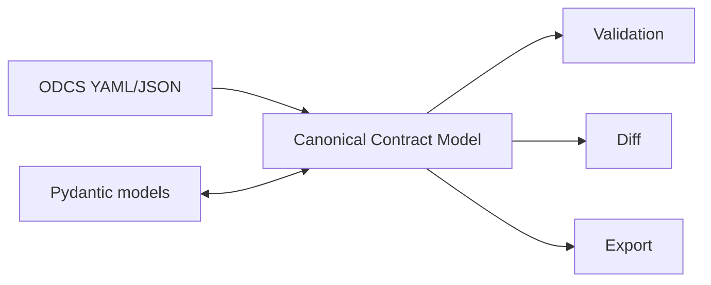

# ContractModel

[](https://pypi.org/project/contractmodel/)
[](https://www.python.org/downloads/)
[](https://opensource.org/licenses/MIT)
[](https://github.com/eddiethedean/contractmodel/actions/workflows/ci.yml)
[](https://eddiethedean.github.io/contractmodel/)
[](https://github.com/eddiethedean/contractmodel/blob/main/STABILITY.md)

**Python-native data contracts** — import [ODCS](https://github.com/bitol-io/open-data-contract-standard) (Open Data Contract Standard), validate with Pydantic, diff versions for breaking changes, and export to JSON Schema, OpenAPI, and more.

`pip install contractmodel` · CLI: `contract` · typed ([PEP 561](https://peps.python.org/pep-0561/))

## At a glance

```python
from contractmodel import DataContract, ValidationMode
from contractmodel.examples import example_path, load_example

contract = load_example("customer_events.odcs.yaml")
CustomerEvent = contract.to_pydantic()

result = contract.validate_record(
    {
        "event_id": "550e8400-e29b-41d4-a716-446655440000",
        "customer_id": "C123",
        "event_timestamp": "2026-06-23T12:00:00",
        "event_type": "created",
    },
    mode=ValidationMode.STRICT,
)

if result:
    print("valid")
else:
    result.raise_for_errors()
```

Works immediately after `pip install` — examples ship inside the package.

## Who this is for

| Audience | Use case |
|----------|----------|
| **Data platform engineers** | ODCS YAML contracts that drive runtime validation in Python pipelines |
| **API and analytics teams** | Pydantic models generated from a shared contract — not hand-maintained duplicates |
| **Governance-minded teams** | Breaking-change detection when contracts evolve across services or datasets |

## Why ContractModel?

| Approach | Strength | Gap |
|----------|----------|-----|
| **Pydantic alone** | Fast record validation | No ODCS import, contract diffing, or governance format |
| **Great Expectations / Soda** | Data quality suites | Not contract-first; weak ODCS/CCM round-trip |
| **Raw ODCS tooling** | Standard YAML contracts | No unified validation, diff, and Pydantic generation |
| **ContractModel** | CCM hub: ODCS ↔ Pydantic ↔ validation ↔ diff ↔ export | 0.2.x — see [STABILITY.md](https://github.com/eddiethedean/contractmodel/blob/main/STABILITY.md) for experimental areas |

> **0.2.x stability** — Core `DataContract` APIs are stable; plugins, registry publish, and some quality rules are experimental. ODCS document conformance uses [pyodcs](https://pypi.org/project/pyodcs/) (`apiVersion: v3.1.0` only). See [STABILITY.md](https://github.com/eddiethedean/contractmodel/blob/main/STABILITY.md) before adopting in production.

## Installation

```bash
pip install contractmodel
```

Optional extras:

```bash
pip install "contractmodel[pandas]"    # Pandas + CSV validation
pip install "contractmodel[polars]"    # Polars validation
pip install "contractmodel[parquet]"   # Parquet file validation
pip install "contractmodel[semantic]"  # RDF / SHACL / OWL export
pip install "contractmodel[all]"       # everything
```

Requires Python 3.10+. The `contract` CLI is included in the base install.

## Quick start

### Load a contract

Auto-detects CCM vs ODCS from file content. Use `load()` for extension-based loading, or the format-specific helpers:

```python
from contractmodel import DataContract
from contractmodel.examples import example_path, load_example, list_examples

# Bundled examples (pip install)
contract = load_example("customer_events.odcs.yaml")
print(contract.name, contract.version, contract.schema.fields)

# Same contract, native CCM format
ccm_contract = DataContract.load(example_path("customer_events.ccm.yaml"))

# From a git clone — repository paths also work
repo_contract = DataContract.from_odcs("examples/customer_events.odcs.yaml")

print(list_examples())  # ['customer_events.ccm.yaml', 'customer_events.odcs.yaml', ...]
```

### Validate data

Validate records, files, or in-memory payloads. Reuse the Pydantic model from `to_pydantic()` for application code; use `validate_*` for contract enforcement and structured `CM_*` error codes.

```python
from contractmodel import DataContract, ValidationMode
from contractmodel.examples import example_path, load_example

contract = load_example("customer_events.odcs.yaml")

# Single record — see "At a glance" for a full payload
result = contract.validate_record({...}, mode=ValidationMode.STRICT)

# File — format inferred from extension; optional size limits
result = contract.validate(
    example_path("data/customer_event.json"),
    max_bytes=1_000_000,
    max_rows=10_000,
)

# CSV (requires contractmodel[pandas])
result = contract.validate_csv(example_path("data/events.csv"), mode=ValidationMode.STRICT)

if not result:
    for err in result.errors:
        print(err.code, err.field, err.message)
    result.raise_for_errors()
```

`ValidationResult` is truthy when validation succeeds (`if result:` / `if not result:`).

### Diff contract versions

```python
from contractmodel import CompatibilityMode, DataContract

old = DataContract.load("v1.yaml")
new = DataContract.load("v2.yaml")

diff = old.diff(new, mode=CompatibilityMode.BACKWARD)

if diff.is_breaking:
    for change in diff.breaking_changes:
        print(change.message)

# Or the boolean shortcut
assert not old.has_breaking_changes(new)
```

Renames linked by field aliases are diffed for definition changes; required-field removal is breaking in `FORWARD` mode.

### Export and round-trip

```python
contract.to_json_schema()
contract.to_openapi()
contract.to_markdown()
contract.to_odcs()
contract.save("out.ccm.yaml")          # write CCM YAML
contract.to_yaml("out.ccm.yaml")      # same, explicit

contract.to_shacl()   # requires contractmodel[semantic]
```

Generate typed models (subclass `ContractModel`, cached per contract and mode):

```python
CustomerEvent = contract.to_pydantic(mode=ValidationMode.STRICT)
# model fields match the contract schema
```

Reverse direction — build a contract from an existing Pydantic model:

```python
contract = DataContract.from_pydantic(CustomerEvent, name="customer_events")
```

## CLI

```bash
contract init contract.yaml
contract init myapp --template fastapi
contract validate contract.yaml data.json
contract validate contract.yaml data.json --output sarif   # CI / GitHub Code Scanning
contract diff old.yaml new.yaml
contract generate pydantic contract.yaml --output models.py
contract export contract.yaml --to json-schema
contract export contract.yaml --to shacl
contract publish contract.yaml --registry https://registry.example.com
contract doctor    # list installed plugins (names only)
```

From a git clone:

```bash
contract validate examples/customer_events.odcs.yaml examples/data/customer_event.json
contract validate examples/customer_events.odcs.yaml examples/data/events.csv --format csv
```

See the [CLI walkthrough](https://github.com/eddiethedean/contractmodel/blob/main/docs/tutorials/cli-walkthrough.md) and [CI with SARIF](https://github.com/eddiethedean/contractmodel/blob/main/docs/tutorials/ci-sarif.md) tutorials.

## Features

| Area | Capabilities |
|------|----------------|
| **Formats** | ODCS import/export, native CCM YAML/JSON, Pydantic round-trip |
| **Validation** | `STRICT`, `PERMISSIVE`, `SCHEMA_ONLY`, `QUALITY_ONLY` modes |
| **Data sources** | Records, JSON, CSV, Parquet, Pandas, Polars (optional extras) |
| **Diff** | Field-level changes, breaking vs non-breaking, rename detection |
| **Export** | JSON Schema, OpenAPI, Markdown, ODCS, RDF, SHACL, OWL |
| **Extensibility** | Plugin SDK for validators, exporters, registries (experimental) |
| **Tooling** | `contract` CLI, bundled examples, `CM_*` error catalog for CI |

## Validation modes

| Mode | Behavior |
|------|----------|
| `STRICT` | Reject extra fields; full constraint validation |
| `PERMISSIVE` | Allow extra fields (including nested objects) |
| `SCHEMA_ONLY` | Structure and types only |
| `QUALITY_ONLY` | Run CCM quality rules (completeness; freshness is a stub warning) |

## Glossary

| Term | Meaning |
|------|---------|
| **CCM** | Canonical Contract Model — ContractModel's internal, format-agnostic representation |
| **ODCS** | Open Data Contract Standard — YAML contract format from [Bitol](https://bitol.io/) |
| **DataContract** | Main Python facade — load, validate, diff, and export contracts |
| **`contract`** | CLI installed with the package |

## What's next

**0.2.0** ships the semantic kernel (descriptors, fingerprints, recognition,
`LoadingPolicy`). Next up is **0.3** bounded validation, then the **0.4**
adapter/fidelity framework before new format adapters. See [ROADMAP.md](ROADMAP.md).

## Performance

Validation loads full datasets into memory. For 0.1.x, keep files under **~100 MB** and **~1 million rows** unless you benchmark larger workloads. Call `to_pydantic()` once per contract and reuse the model class.

Optional `max_bytes` and `max_rows` on validation entry points guard against oversized payloads. Non-positive limits raise `ValueError`. Bounded streaming and redaction by default are planned for **0.3**.

## Plugins (experimental)

Register plugins via `pyproject.toml` entry points. Installed plugins run after built-in validation and can extend export/publish when their `target` matches the requested format.

```toml
[project.entry-points."contractmodel.validators"]
my_validator = "my_package:MyValidator"
```

Run `contract doctor` to list plugin names (without loading plugin code). See [STABILITY.md](https://github.com/eddiethedean/contractmodel/blob/main/STABILITY.md) for API guarantees.

## Security

See [SECURITY.md](https://github.com/eddiethedean/contractmodel/blob/main/SECURITY.md) for registry trust, plugin install guidance, and data file limits.

## Documentation

**Hosted docs:** [eddiethedean.github.io/contractmodel](https://eddiethedean.github.io/contractmodel/)

| Resource | Link |
|----------|------|
| Getting started | [docs/tutorials/getting-started.md](https://github.com/eddiethedean/contractmodel/blob/main/docs/tutorials/getting-started.md) |
| CLI walkthrough | [docs/tutorials/cli-walkthrough.md](https://github.com/eddiethedean/contractmodel/blob/main/docs/tutorials/cli-walkthrough.md) |
| Pydantic round-trip | [docs/tutorials/pydantic-roundtrip.md](https://github.com/eddiethedean/contractmodel/blob/main/docs/tutorials/pydantic-roundtrip.md) |
| Diff in CI | [docs/tutorials/diff-workflow.md](https://github.com/eddiethedean/contractmodel/blob/main/docs/tutorials/diff-workflow.md) |
| SARIF / GitHub Actions | [docs/tutorials/ci-sarif.md](https://github.com/eddiethedean/contractmodel/blob/main/docs/tutorials/ci-sarif.md) |
| API reference | [docs/reference/api.md](https://github.com/eddiethedean/contractmodel/blob/main/docs/reference/api.md) |
| Error codes (`CM_*`) | [docs/reference/error-codes.md](https://github.com/eddiethedean/contractmodel/blob/main/docs/reference/error-codes.md) |
| Examples | [examples/README.md](https://github.com/eddiethedean/contractmodel/blob/main/examples/README.md) |
| Changelog | [CHANGELOG.md](https://github.com/eddiethedean/contractmodel/blob/main/CHANGELOG.md) |
| Roadmap | [ROADMAP.md](https://github.com/eddiethedean/contractmodel/blob/main/ROADMAP.md) |
| Architecture | [docs/architecture/](https://github.com/eddiethedean/contractmodel/tree/main/docs/architecture) |
| Format roadmap | [docs/roadmap/03-data-contract-formats.md](https://github.com/eddiethedean/contractmodel/blob/main/docs/roadmap/03-data-contract-formats.md) |

## Architecture

All external representations flow through the CCM:



The CCM is format-agnostic. Adapters handle conversion; engines operate only on the canonical model.

## Development

See [CONTRIBUTING.md](https://github.com/eddiethedean/contractmodel/blob/main/CONTRIBUTING.md) for setup, pre-commit, and PR expectations.

```bash
git clone https://github.com/eddiethedean/contractmodel.git
cd contractmodel
pip install -e ".[all]" --group dev
pre-commit install
pytest
```

Build docs locally: `mkdocs serve` (see [docs/README.md](https://github.com/eddiethedean/contractmodel/blob/main/docs/README.md)).

## License

MIT — see [LICENSE](https://github.com/eddiethedean/contractmodel/blob/main/LICENSE).
